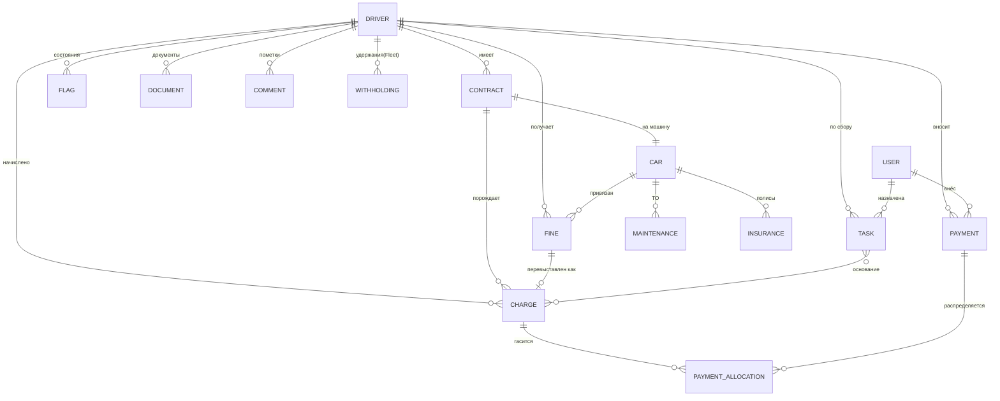

# Дата-модель: карточка водителя и учёт

Фундамент переноса управления водителями в приложение. Стек-агностично (маппится на Postgres/JPA). Имена полей согласованы с текущим дашбордом (`closedBalance`, `obligation`, `paid`, `remaining`, `status`, `agingBucket`), чтобы он лёг на эту модель без переделки логики.

## Принцип

**Карточка водителя — это агрегат**, собирающий вокруг себя договор, машину, платежи, начисления, штрафы, флаги, документы, задачи. Баланс — **производное**: `Σ начислений − Σ платежей`. Это та же логика, что в дашборде (`Осталось = сумма мес. + оплачено`), но нормализованная.

## ER-схема

## Сущности

### DRIVER — водитель
| Поле | Тип | Назначение |
|---|---|---|
| id | uuid | PK |
| fio | text | ФИО |
| phone | text | телефон |
| telegram_id / max_id | text | каналы бота |
| status | enum | `active` / `archived` |
| source | enum | `avito` / `yandex_garage` / `referral` |
| onboarded_at | date | дата старта |
| risk_score | int | скоринг (производное, позже) |

### CONTRACT — договор
| Поле | Тип | Назначение |
|---|---|---|
| id | uuid | PK |
| driver_id | fk | → DRIVER |
| car_id | fk | → CAR |
| type | enum | `rent` (аренда) / `buyout` (выкуп) |
| daily_rate | money | ставка/сутки (аренда) |
| schedule | jsonb | график платежей (выкуп) |
| deposit | money | залог |
| started_at / ended_at | date | срок |
| status | enum | `active` / `closed` / `suspended` |

### CAR — машина
| Поле | Тип | Назначение |
|---|---|---|
| id | uuid | PK |
| plate | text | гос.номер (есть в дашборде) |
| brand/model/year | text/int | описание |
| vin | text | VIN |
| odometer | int | пробег |
| status | enum | `assigned` / `free` / `service` |

### CHARGE — начисление (обязательство)
| Поле | Тип | Назначение |
|---|---|---|
| id | uuid | PK |
| driver_id / contract_id | fk | привязка |
| period | daterange | день/месяц начисления |
| type | enum | `rent` / `buyout` / `fine` / `deposit` |
| amount | money | сумма (отрицательная = долг, как в листе) |
| status | enum | `open` / `partial` / `settled` |

### PAYMENT — платёж + PAYMENT_ALLOCATION — распределение
| PAYMENT | Тип | |
|---|---|---|
| id | uuid | PK |
| driver_id | fk | |
| paid_at | timestamp | дата |
| amount | money | сумма (положительная) |
| channel | enum | `cash` / `card` / `fastpay` / `withholding` |
| entered_by | fk → USER | **кто внёс отметку** (ручной ввод) |
| receipt_url | text | чек |
| note | text | комментарий к платежу |

`PAYMENT_ALLOCATION (payment_id, charge_id, amount)` — один платёж может гасить несколько начислений. Баланс водителя = `Σ open charges`.

### FINE — штраф
| Поле | Тип | Назначение |
|---|---|---|
| id | uuid | PK |
| car_id / driver_id | fk | привязка |
| occurred_at | date | дата нарушения |
| article / source | text | статья, источник («Моя ГИБДД») |
| amount | money | сумма штрафа |
| markup | num | наценка (×1.5) |
| rebilled_amount | money | перевыставлено клиенту |
| status | enum | `new` / `rebilled` / `withheld` / `paid` |
| charge_id | fk | → CHARGE (как перевыставлен) |

### FLAG — состояние водителя (управляющий сигнал!)
| Поле | Тип | Назначение |
|---|---|---|
| id | uuid | PK |
| driver_id | fk | |
| type | enum | `accident` / `installment` / `do_not_touch` / `dispute` |
| reason | text | причина |
| active_from / active_to | date | период |
| set_by | fk → USER | кто поставил |

> **Флаг перекрывает автоматику:** активный `accident`/`do_not_touch` блокирует постановку WITHHOLDING и генерацию TASK.

### WITHHOLDING — удержание в Яндекс.Fleet (рычаг, H2)
| Поле | Тип | |
|---|---|---|
| id | uuid | PK |
| driver_id | fk | |
| amount | money | сумма заморозки |
| fleet_external_id | text | id удержания в Fleet |
| status | enum | `applied` / `released` |
| charge_id | fk | основание |

### TASK — задача сборщику (конвейер)
| Поле | Тип | Назначение |
|---|---|---|
| id | uuid | PK |
| driver_id | fk | |
| amount_due | money | сколько собрать |
| basis_charge_ids | uuid[] | основание |
| document_ids | uuid[] | прикреплённые документы |
| priority | int | приоритет |
| assignee | fk → USER | Слава / Женя |
| status | enum | `open` / `in_progress` / `done` / `escalated` |
| sla_due_at | timestamp | срок |
| escalation_log | jsonb | история эскалаций |

### COMMENT — пометка (→ может породить флаг)
| id, driver_id/payment_id, text, author, created_at, ai_class |
`ai_class` — авто-классификация (🤖): «авария» → предлагает создать FLAG.

### DOCUMENT — документ-основание
| id, driver_id/contract_id, type (`contract`/`pts`/`photo`/`signing_video`), url, created_at |

### MAINTENANCE / INSURANCE — ТО и страховка
ТО: `car_id, date, odometer, type, receipt_url, status`. Страховка: `car_id, insurer, period, status`.

### USER — оператор / сборщик / собственник (RBAC)
| id, name, role (`operator`/`collector`/`owner`/`admin`) |

## Производные представления (для дашборда)

- **balance(driver)** = `Σ open CHARGE.amount` → это `closedBalance` дашборда.
- **monthly(driver)** = группировка CHARGE/PAYMENT по месяцу → текущая помесячная таблица и матрица.
- **aging / status / daysWithoutPayment** — вычисляются как сейчас, поверх CHARGE/PAYMENT.
- **collectionRate(month)** = `Σpaid / Σcharged` за месяц.

## Миграция с текущего листа

Google-таблица → импорт: блок-месяц → CHARGE (`rent/buyout`, period=месяц), ежедневные платежи → PAYMENT(`cash`), «Осталось» сверяется с `balance`. Лист остаётся источником первичного импорта; дальше — ручной ввод PAYMENT через форму.
