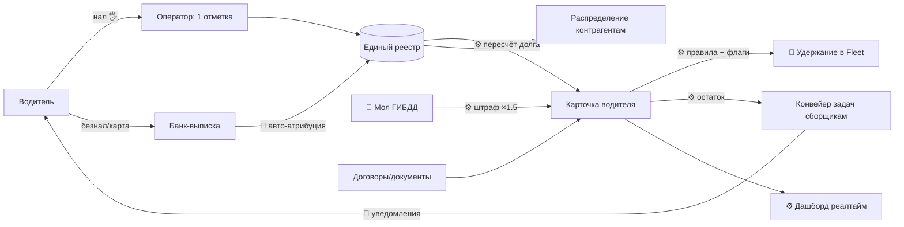

# Карта процессов: As-Is → To-Be

Оцифровка таксопарка (аренда + выкуп авто, работа через Яндекс). Построена «от общего к частному»: сначала контур, затем каждый процесс.

## Принципы (из ИКР)

1. **Единственная намеренно-ручная точка** — физический приём нала от водителя + **одна** отметка «получено». Без двойных подтверждений.
2. **Учёт заносится руками**, всё вокруг отметки — автоматически (пересчёт долга, задачи, уведомления, дашборд).
3. **Рычаг, а не касса:** удержание в Яндекс.Fleet применяется как гарантия оплаты и снимается по ручной отметке. Деньги собираются налом.
4. **Флаги состояния перекрывают автоматику:** `авария / рассрочка / не трогать` → авто-удержание и задачи не ставятся.
5. **Единый реестр (one source of truth)** при множестве каналов оплаты — схлопываем учёт, не каналы.

## Условные обозначения

| Значок | Смысл |
|---|---|
| 🖐 | остаётся ручным **намеренно** |
| ⚙️ | автоматизируется системой |
| 🔌 | интеграция с внешним сервисом |
| 🤖 | бот / ИИ-классификация |

---

## Уровень 0 — Общий контур

Контур: деньги входят (нал — ручной приём; безнал — авто) → **единый реестр** → **карточка водителя** (пересчёт, правила, флаги) → ветки: рычаг-удержание, задачи сборщикам, штрафы, распределение контрагентам, дашборд.

---

## Уровень 1 — Процессы

### 1. Приём оплаты (аренда / выкуп)
| | |
|---|---|
| **As-Is** | Нал и безнал разными каналами; чеки в разных мессенджерах; ~60% на карты с середины мая; разносится вручную через банк-клиент |
| **To-Be** | 🖐 приём нала + **одна** отметка «получено X от водителя Y» → ⚙️ дальше всё само. Безнал: 🤖 авто-атрибуция из выписки (позже). Без двойных подтверждений |
| Ручное | физический приём нала + отметка |
| Авто | пересчёт долга, снятие удержания, закрытие задачи, уведомления |

### 2. Учёт и расчёт долга
| | |
|---|---|
| **As-Is** | Excel/таблица руками; долг считается в голове/вручную; текущий дашборд читает ручной лист |
| **To-Be** | ⚙️ долг по водителю и общий пересчитывается мгновенно после отметки; лист → форма ввода + БД; дашборд остаётся «видом сверху» |
| Ручное | ввод платежа |
| Авто | расчёт долга, агрегаты, история |

### 3. Рычаг-удержание (Яндекс.Fleet)
| | |
|---|---|
| **As-Is** | Рычага нет; давление = обзвон руками |
| **To-Be** | ⚙️ при просрочке система 🔌 ставит удержание в Fleet на сумму долга → доход «заморожен» → водитель приходит платить; по отметке «получено» удержание ⚙️ снимается. Флаг «авария» блокирует удержание |
| Ручное | — |
| Авто/Интеграция | постановка/снятие удержания по правилам и флагам |
| Зависимости | возможности Fleet API; юр-право на удержание в договоре; защита от двойного списания (снятие строго по отметке) |

### 4. Конвейер задач сборщикам (Слава / Женя)
| | |
|---|---|
| **As-Is** | Серёга вручную решает, кому звонить и сколько собрать |
| **To-Be** | ⚙️ задача генерится сама только на остаток, который не закрыли отметка/удержание; с приоритетом, суммой и 📎 основанием/документом; SLA и авто-эскалация (бот → сборщик → Серёга). Не «список должников», а самоуменьшающийся конвейер |
| Ручное | сам звонок/приём нала |
| Авто | генерация, приоритизация, прикрепление основания, эскалация |

### 5. Штрафы ГИБДД
| | |
|---|---|
| **As-Is** | «Моя ГИБДД» (~4 т/мес); таблица руками; Дёмин обзванивает; перевыставление клиенту ×1.5 |
| **To-Be** | 🔌 авто-сбор штрафов из «Моя ГИБДД» → ⚙️ привязка к водителю/машине → ⚙️ перевыставление ×1.5 → удержание/задача; авто-уведомление водителю |
| Ручное | спорные случаи |
| Авто | сбор, привязка, наценка, начисление, уведомление |

### 6. Договоры и документооборот + онбординг
| | |
|---|---|
| **As-Is** | Лиды (Авито, Яндекс.Гараж, Макс); договор готовит Дёмин/Женя; хранение разрозненное; подписание без фиксации |
| **To-Be** | ⚙️ договор генерится из шаблона по карточке; 🖐 подписание с 📹 видео-фиксацией; ⚙️ хранение в карточке водителя; документы прикрепляются к задачам как основание |
| Ручное | подписание |
| Авто | генерация, хранение, привязка к карточке |

### 7. Распределение денег контрагентам (кэш-менеджмент)
| | |
|---|---|
| **As-Is** | Серёга вручную «лавирует» между юрлицами-поставщиками (лизинг, страховки, ЗП); денег часто не хватает |
| **To-Be** | ⚙️ реестр обязательств перед контрагентами + приоритеты; ⚙️ прогноз кассового разрыва; подсказки «кому и сколько». Сами платежи — по решению человека |
| Ручное | решение/исполнение платежа |
| Авто | реестр, приоритеты, прогноз разрыва |

### 8. Техобслуживание (ТО)
| | |
|---|---|
| **As-Is** | Аренда — свой «ТОшник»; выкуп — водитель сам, контроль фактически отсутствует |
| **To-Be** | ⚙️ график ТО по пробегу/времени; 🤖 напоминания водителю; ⚙️ требование чека/фото; статус «ТО просрочено» в карточке |
| Ручное | само обслуживание |
| Авто | график, напоминания, контроль чеков |

### 9. Страхование
| | |
|---|---|
| **As-Is** | Аутсорс «Верный путь» (20%); выплаты растут; учёт вне системы |
| **To-Be** | ⚙️ реестр полисов и сроков в карточке; ⚙️ напоминания о продлении; учёт страховых случаев/выплат |
| Ручное | работа партнёра |
| Авто | реестр, сроки, напоминания |

### 10. Дашборд и отчётность
| | |
|---|---|
| **As-Is** | Дашборд по долгу (готов, реалтайм из листа) |
| **To-Be** | ⚙️ + метрики: динамика дебиторки, разрез по клиентам, штрафы начислено/удержано, сколько водителей на удержании/FastPay, заработок, возвратность |
| Авто | всё |

---

## Что остаётся ручным (явно и намеренно)

- 🖐 физический приём нала от водителя;
- 🖐 одна отметка «получено» (ввод платежа в учёт);
- 🖐 сам звонок сборщика (по задаче, которую сгенерила система);
- 🖐 подписание договора (с видео-фиксацией);
- 🖐 решение по платежам контрагентам.

Всё остальное — ⚙️/🔌/🤖.

---

## Последовательность внедрения (от общего к частному)

1. **Ядро H1:** единый реестр + карточка водителя + форма ручного ввода платежа + авто-расчёт долга + дашборд. *(частично уже есть)*
2. **Конвейер задач** сборщикам с основанием + уведомления (бот Telegram/MAX).
3. **Рычаг-удержание** в Fleet (после проверки API и юр-оформления) + флаги состояния.
4. **Штрафы** из «Моя ГИБДД» → ×1.5 → удержание.
5. **Контрагенты/кэш-менеджмент, ТО, страхование** — реестры и напоминания.
6. **Безнал-авто-атрибуция, CX-анализ, фин-модель** — позже.

---

## Открытые зависимости и риски

- 🔌 **Yandex Fleet API** — подтвердить программные удержания/блокировки и доступ к штрафам.
- ⚖️ **Юр-право на удержание** из дохода — прописать в договоре + согласие.
- 🛡 **Двойное списание** — удержание снимается строго по ручной отметке (safeguard).
- 🔐 **Разнос ЭЦП/IP по юрлицам** (СБИС/Диадок) — отдельный трек безопасности при передаче Карлайма.
- 💀 **Over-collection** — авто-удержание не должно «убить» водителя как актив: оставляем минимум, флаги перекрывают правила.
